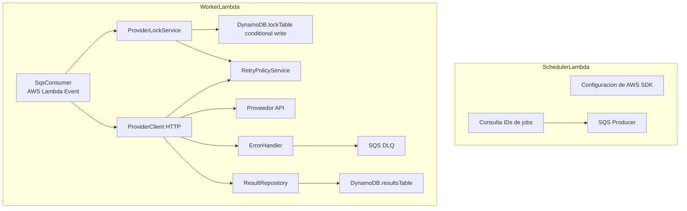
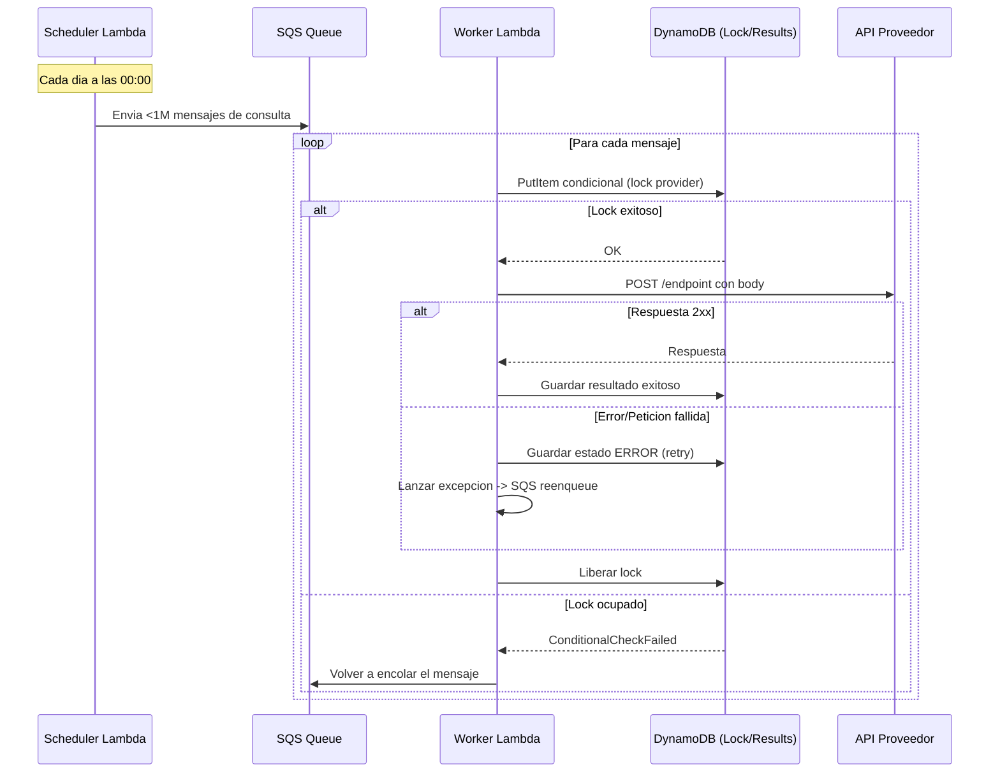

# C4 - Diagrama de Componentes (Nivel 3)

## Componentes Internos de las Lambdas

## Lambda Scheduler - Componentes

### Configuracion AWS SDK

- Inicializa clientes DynamoDB y SQS
- Configura región y credentials

### Consulta IDs de Jobs

- Lee registros de DynamoDB por página
- Calcula offset basado en la hora

### SQS Producer

- Publica mensajes en cola FIFO
- MessageGroupId = proveedor
- MessageDeduplicationId = hash(jobId + fecha)

## Lambda Worker - Componentes

### SqsConsumer

- Recibe evento SQS
- Extrae mensaje del body
- Parsea job y fecha

### ProviderLockService

- Intenta acquire lock con PutItem condicional
- ConditionExpression: `attribute_not_exists(pk)`
- Retorna true/false

### ProviderClient HTTP

- Llama a API interna con axios
- Implementa retry exponencial
- Timeout configurado

### RetryPolicyService

- Clasifica errores (RETRYABLE vs NON_RETRYABLE)
- 4xx = no reintentar
- 5xx + timeout = reintentar

### ErrorHandler

- Maneja errores no recuperables
- Envía a DLQ si max retries

### ResultRepository

- Persiste resultado en DynamoDB
- pk = jobId#fecha (único por día)

## Diagrama de Secuencia

